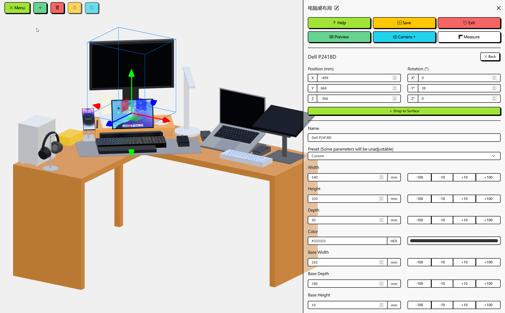

<h1 align="center">Desk AR</h1>

<p align="center">
Rapidly plan your ideal desk layout in 3D, then bring it into reality with AR. 
</p>

<p align="center">
	<a href="https://github.com/Siriusq/desk-ar/blob/master/README/README-CN.md"></a>
  <a href="https://siriusq.top/desk-ar/"></a>
  
  
  
      
  
</p>

<p align="center">
  
</p>

## 📖 Overview

**Desk AR** is a web app designed to help you plan your ideal desk layout—quickly, visually, and without lifting a single piece of hardware.

Powered by a large collection of highly customizable preset models and the rendering capabilities of Three.js, you can freely place, adjust, and experiment with items in a virtual desk environment. Build your setup exactly the way you imagine it.

When you're satisfied with the layout, use the **AR Preview** to project your virtual setup into the real world. View it in actual scale, check proportions, spot potential issues, and jump back into the 3D editor to make adjustments—all without unplugging cables, moving heavy equipment, or second-guessing measurements.

<h3 align="center">
	<a href="https://siriusq.top/desk-ar/">🔗 Try Desk AR Online</a>
</h3>

## 🧠 Why I Built This

As my desk grew more crowded, I found myself constantly rearranging things in search of the perfect working environment. But in the real world, reorganizing a desk is slow, tiring, and occasionally painful—especially when dealing with sharp edges, awkward angles, or cable spaghetti.

After one particularly frustrating attempt (and a minor skirmish with my PC case), I finally snapped and thought: _Why isn’t there a tool that helps me plan my desk before I physically move anything?_

A quick search revealed that existing tools either used fixed-size models or offered only rough approximations. Nothing gave me the flexibility I needed.

So… fine. I’d make my own.

But I also wanted to be lazy, so I tried Vibe Coding and let AI generate the project for me. One week later, after wrestling with increasingly chaotic auto-generated code and a single giant HTML file that became impossible to debug, I gave up. (If you're curious, you can take a look at the **AI-generated code mess** here: [DeskSetupAR](https://github.com/Siriusq/DeskSetupAR).)

After digging out the few usable bits, I rebuilt the entire project from scratch.

That’s how **Desk AR** was born.

## ✨ Features

<p align="center">
  
</p>

- 🎛 **Highly customizable models**: All built-in models support extensive customization of size, color, name, and more. Many offer detailed adjustable parameters, such as:
  - **Monitor**: Adjustable screen size, stand base size, height, tilt angle, swivel angle, etc.
  - **Laptop**: Freely adjustable screen opening angle.
  - **Stand**: Accurately simulates the state of mounted objects.
  - **Desk**: Supports not only rectangular desks but also L-shaped corner desks.
  - **Presets available**: If you’re unsure about the dimensions, some models include preset configurations you can apply directly.
- 🔮 **AR Preview**: Project your virtual desk setup into your real environment to review the layout immersively and discover potential issues early.
- ↩️ **Action history**: Supports undo and redo, making it easy to fine-tune adjustments at any time.
- 📥 **Model import**: Supports importing **GLB models**. You can download high-quality assets from websites like Sketchfab to supplement the built-in presets.
- 📷 **Free camera view**: Adjust the camera to inspect your layout from any angle.
- 📏 **Distance measurement**: Quickly estimate required cable lengths or spacing between items.
- 💾 **Data import & export**: Save layouts as JSON files to easily restore previous desk configurations.

## 📃 Usage

### 🕹 Basic controls

**Due to the complexity of 3D interactions, it is strongly recommended to arrange scenes on a desktop and use AR Preview on mobile.**

- **Left mouse / single-finger drag**: rotate the camera
- **Mouse wheel / two-finger pinch**: zoom the camera in/out
- **Right mouse / two-finger drag**: pan the camera
- **Left click / single-finger tap an object**: select an item
- **When selected, click / tap the same item again**: toggle Move / Rotate gizmo
- **Left click / single-finger tap empty space**: deselect

### ⌨️ Shortcuts

- **Ctrl / Command + Z**: Undo
- **Ctrl / Command + Y**: Redo
- **Ctrl / Command + S**: Save scene as a JSON file
- **Add / +**: Add item
- **Del**: Delete selected item
- **Backspace**: Exit
- **H**: Open help
- **M**: Open menu
- **P**: Enter (AR) Preview mode

### 🔮 AR Preview

<p align="center">
  
</p>

- Click the **Preview** button in the menu → choose whether to include the desk → go to the preview page
- If the device supports AR, an **AR Mode** button will appear in the top-right corner; tap it to invoke the camera and start AR preview
- If AR is not supported, the scene will be shown in regular 3D preview

### 🧭 Menu features

- Select items in the scene, or choose them from the **Item List**, to open the detail panel and adjust more parameters
- **Scene name**: click the button next to the scene name at the top of the menu to edit it. The saved JSON file will use this name
- **Position & rotation**: gizmo color → axis mapping: X = Red, Y = Green, Z = Blue
- **Drop-to-surface button**: snap an item to the top surface of the nearest object
- **Name**: some items support custom names; leave blank to use the default name
- **Presets**: some items include size presets; when enabled, preset values cannot be edited individually
- **Numeric inputs**: increment/decrement buttons at the right of numeric fields provide quick adjustments and support long-press. Default units: millimeters (mm) for length, degrees (°) for angles
- **Mounted items**: some models support mounting on custom stands. Supported items appear in the **Mounted Items** dropdown on the stand’s detail page. After mounting, certain position or rotation parameters may no longer take effect

### 📦 Model import

- Supports importing **GLB** model files
- You can download models from sites like [Sketchfab](https://sketchfab.com/feed)
- Imported models may have a different scale than the scene; use **Blender** or similar tools to rescale before importing if needed

## 🛠️ Tech Stack

- Deployment: [GitHub Pages](https://pages.github.com/)
- Framework: [Vue.js](https://cn.vuejs.org/)
- 3D Engine: [Three.js](https://threejs.org/)
- AR: [model-viewer](https://modelviewer.dev/)
- UI & Theme: [Bootstrap Vue Next](https://github.com/bootstrap-vue-next/bootstrap-vue-next) + [Bootswatch: Brite](https://bootswatch.com/brite/)

## ▶️ Running Locally

Desk AR is available online but can also be run locally. Notes:

1. **model-viewer** depends on an older version of Three.js that is incompatible with the Three.js used in this project. This can cause peer-dependency errors during installation — install it with:
   ```bash
   npm install @google/model-viewer --legacy-peer-deps
   ```
2. AR Preview requires an **HTTPS** connection. On Android, using plain HTTP will cause the AR services to crash. Start a local HTTPS dev server with:
   ```bash
   npm run dev -- --host
   ```
3. After enabling HTTPS, accessing the site from other devices on the LAN may trigger browser security warnings because no SSL certificate is configured. In that case, you can ignore the warning and proceed to the site.

## ⚠️ Known Issues

- AR Preview requires browser and OS support:
  - iOS → **Safari**
  - Android → **Chrome**
- AR may not work on some devices because:
  - Browser lacks WebXR support
  - Android ROM does not include ARCore services

## ©️ Credits

- HDRI: [Kloofendal Misty Morning (Pure Sky) HDRI • Poly Haven](https://polyhaven.com/a/kloofendal_misty_morning_puresky)
- Welcome page background pattern: [Pattern Craft - Modern Background Patterns & Gradients Snippets](https://patterncraft.fun/)
- Soundbar mesh texture: [Image by freepik](https://www.freepik.com/free-photo/background-with-metallic-mesh-round-holes_40199170.htm#fromView=search&page=1&position=7&uuid=e8a75a42-32e5-4663-9001-07de579e2018&query=Metal+circular+grid+texture)
- Microphone mesh texture: [Image by dotstudio on Freepik](https://www.freepik.com/free-vector/net-shape-texture-design_853770.htm#fromView=search&page=1&position=0&uuid=d55db6e8-61a6-4741-aa90-654865721a6e&query=microphone+texture)
- GitHub Corner: [GitHub Corners](https://tholman.com/github-corners/)
