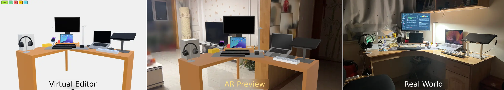
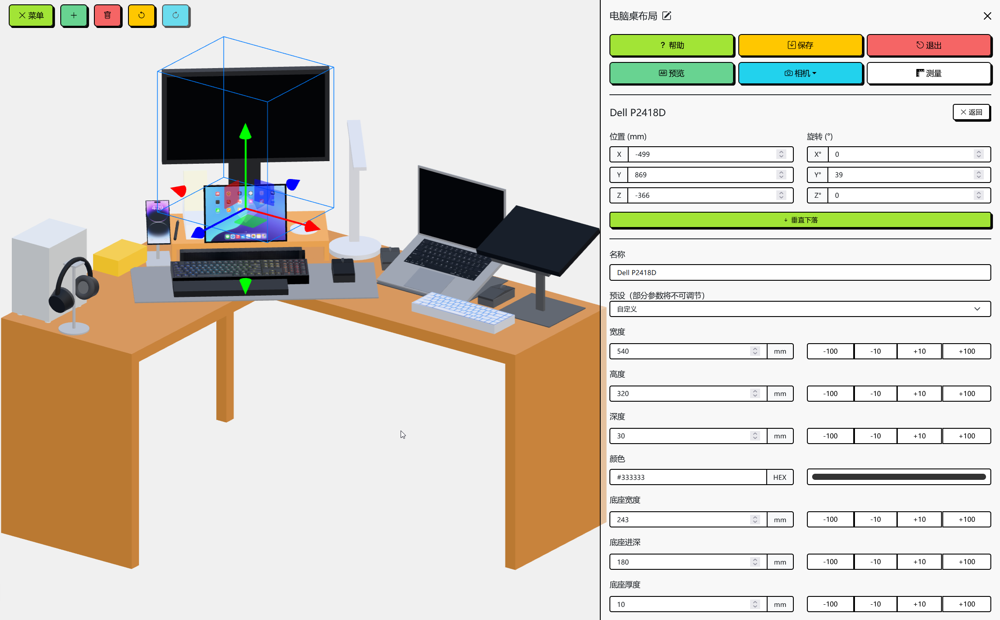
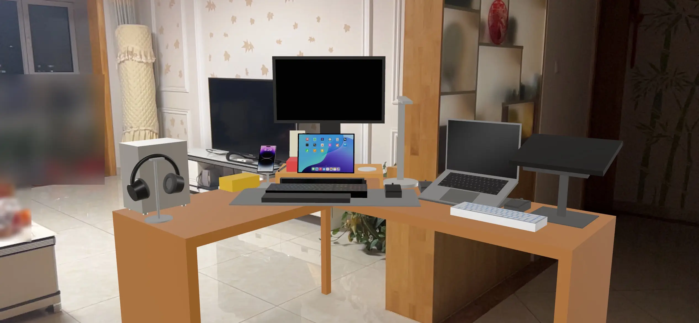

<h1 align="center">Desk AR</h1>

<p align="center">
快速布置你的理想桌面 · 支持 AR 实景预览
</p>

<p align="center">
	<a href="https://github.com/Siriusq/desk-ar/blob/master/README.md"></a>
	<a href="https://siriusq.top/desk-ar/"></a>
    
    
    
        
    
</p>

<p align="center">
  
</p>

## 📖 简介

**Desk AR** 是一款帮助你快速规划理想桌面布局的 Web App。
基于大量可高度自定义的预设物品模型，以及 Three.js 强大的 3D 渲染能力，你可以在虚拟桌面场景中随意摆放、调整物品，构建属于你的桌面空间。

完成布置后，你还可以借助 **AR 预览** 功能，将场景投射到现实世界中，沉浸式查看布局效果，提前发现不合适的地方，再回到 3D 场景中快速修改。
无需来回搬动显示器、机箱，也不必在购买设备前反复测量和纠结 —— 动动手指，即可高效完成桌面规划。

<h3 align="center">
	<a href="https://siriusq.top/desk-ar/">🔗 在线体验 Desk AR</a>
</h3>

## 🧠 开发动机

随着桌面上的东西越来越多，我总是频繁的调整桌面布置，想要找到最舒适的桌面环境。然而现实中的调整不仅费时、费力，还要反复处理沉重设备与杂乱线材 —— 累出一身汗不说，还容易被尖锐部件划伤。

在又一次与机箱滴血认亲后，我破防了，开始思考，有没有能帮助我布置桌面的软件呢？然而一番搜索之后，我并没有发现合适的软件，现有工具大多使用不可调节的固定尺寸模型，只能做粗略的参考。

Fine，那我自己写一个吧。

但是我又有点想偷懒，于是尝试使用 Vibe Coding，让 AI 帮我快速实现。在和AI斗智斗勇一个星期后，我又破防了。随着我加入的功能越来越多，AI 生成的代码也愈发混乱，引入大量错误，甚至连运行都成问题，我用来 Debug 的时间比我自己写都长，而且 AI 坚持把所有代码塞进一个 HTML 文件里，调试起来简直就是噩梦，感兴趣的话可以去看看 [AI 创造的屎山代码](https://github.com/Siriusq/DeskSetupAR)。

最终在浪费了一周时间后，我只能屎里淘金，从零开始重构，于是，**Desk AR** 就这样诞生了。

## ✨ 特性

<p align="center">
  
</p>

- 🎛 **高度可自定义的模型**：内置模型均支持尺寸、颜色、名称等高度自定义，包含大量可调节参数，例如：
  - **显示器**：可调整屏幕尺寸、支架底座大小、升降高度、俯仰角、支架旋转角等
  - **笔记本电脑**：可自由设置屏幕开合角度
  - **支架**：支持真实还原挂载后的姿态
  - **桌子**：不仅提供矩形桌面，还支持转角桌
  - **预设支持**：若不确定物品尺寸，可直接使用部分模型的预设参数。
- 🔮 **AR预览**：将虚拟桌面投影到房间内，沉浸式查看布局效果，提前发现潜在问题
- ↩️ **操作历史**：支持撤销与重做，方便随时调整
- 📥 **模型导入**：支持导入 **GLB 模型**，可从 Sketchfab 等网站获取高质量模型，作为对预设模型的补充
- 📷 **自由视角**：通过相机调整从任意角度观察桌面布局。
- 📏 **距离测量**：轻松估算所需线材长度或物品间距。
- 💾 **数据导入与导出**：使用JSON文件保存数据，可以快速恢复之前布置的桌面

## 📃 使用说明

### 🕹 基础操作

**鉴于 3D 操作的复杂性，强烈建议在桌面端布置场景，在移动端使用 AR 预览**

- **鼠标左键 / 单指拖动**：旋转相机
- **鼠标滚轮 / 双指捏合**：缩放相机远近
- **鼠标右键 / 双指拖动**：平移相机
- **左键单击 / 单指轻触物体**：选中物品
- **选中状态下，再次左键单击 / 单指轻触该物体**：切换移动 / 旋转 Gizmo
- **左键单击 / 单指轻触空白处**：取消选中

### ⌨️ 快捷键

- **Ctrl / Command + Z**：撤销
- **Ctrl / Command + Y**：重做
- **Ctrl / Command + S**：保存场景为 JSON 文件
- **Add / +**：添加物品
- **Del**：删除选中物品
- **Backspace**：退出
- **H**：打开帮助
- **M**：打开菜单
- **P**：进入（AR）预览模式

### 🔮 AR 预览

<p align="center">
  
</p>

- 点击菜单中的**预览**按钮 → 选择是否包含桌子 → 进入预览页面
- 若设备支持 AR，将在右上角显示 **AR 模式** 按钮，可调用相机进行 AR 预览
- 若不支持，则会以普通 3D 模式预览

### 🧭 菜单功能

- 可在场景中选中物品，或通过**物品清单**选择物品，打开其详情菜单以调整更多参数
- **场景名称**：点击菜单顶部场景名称后的按钮可修改名称。保存场景时，JSON 文件将使用此名称
- **位置与旋转**：Gizmo 颜色与坐标轴对应关系：X 轴 = 红色、Y 轴 = 绿色、Z 轴 = 蓝色
- **垂直下落按钮**：可使物品自动贴合至最近物体的顶面
- **名称**：部分物品支持自定义名称；留空则使用默认名称
- **预设**：部分物品带有尺寸预设，启用后预设中的数值不可单独调整
- **数值输入**：数字框右侧按钮可快速加减数值，支持长按。默认长度单位为毫米（mm），角度单位为度（°）
- **挂载物品**：部分模型支持挂载到自定义支架上。支持的物品会显示在支架详情页的**挂载物品**下拉列表中。挂载后，部分位置与旋转参数可能不会生效

### 📦 模型导入

- 支持导入 **GLB** 格式的模型文件
- 可前往 [Sketchfab](https://sketchfab.com/feed) 等模型网站下载模型
- 下载的模型比例可能与场景不一致，可使用 **Blender** 等软件进行缩放后再导入

## 🛠️ 实现

- 部署：[GitHub Pages](https://pages.github.com/)
- 前端框架：[Vue.js](https://cn.vuejs.org/)
- 3D 渲染：[Three.js](https://threejs.org/)
- AR 预览：[model-viewer](https://modelviewer.dev/)
- UI & 主题： [Bootstrap Vue Next](https://github.com/bootstrap-vue-next/bootstrap-vue-next) + [Bootswatch: Brite](https://bootswatch.com/brite/)

## ▶️ 本地运行

Desk AR 已部署于 GitHub Pages，但也可以本地运行。注意事项有：

1. 由于 **model-viewer** 依赖的 three.js 版本较老，与项目使用的 three.js 不同，安装依赖时会报错，请使用这个命令安装它：
   ```bash
   npm install @google/model-viewer --legacy-peer-deps
   ```
2. 使用 AR 预览功能需要启用 **HTTPS** 连接，在 Android 系统上使用默认的 HTTP 连接会导致 AR 服务闪退，为本地服务启用 HTTPS 连接的命令为：
   ```bash
   npm run dev -- --host
   ```
3. 启用 HTTPS 后，局域网访问会触发浏览器安全警告（因未配置证书），选择继续访问即可

## ⚠️ 已知问题

- AR 预览依赖系统与浏览器支持：
  - iOS 请使用 **Safari** 浏览器
  - Android 请使用 **Chrome** 浏览器
- 部分设备可能无法进入 AR 预览，可能的原因有：
  - 当前浏览器不支持 WebXR
  - 使用了缺少 AR 服务的非原生安卓系统
- 正交相机无法调整视角，包括旋转、平移与缩放

## ©️ 引用

- 场景 HDR 背景：[Kloofendal Misty Morning (Pure Sky) HDRI • Poly Haven](https://polyhaven.com/a/kloofendal_misty_morning_puresky)
- 欢迎页背景图案：[Pattern Craft - Modern Background Patterns & Gradients Snippets](https://patterncraft.fun/)
- 条形音响铁网材质：[Image by freepik](https://www.freepik.com/free-photo/background-with-metallic-mesh-round-holes_40199170.htm#fromView=search&page=1&position=7&uuid=e8a75a42-32e5-4663-9001-07de579e2018&query=Metal+circular+grid+texture)
- 话筒铁网材质：[Image by dotstudio on Freepik](https://www.freepik.com/free-vector/net-shape-texture-design_853770.htm#fromView=search&page=1&position=0&uuid=d55db6e8-61a6-4741-aa90-654865721a6e&query=microphone+texture)
- GitHub 角标：[GitHub Corners](https://tholman.com/github-corners/)
